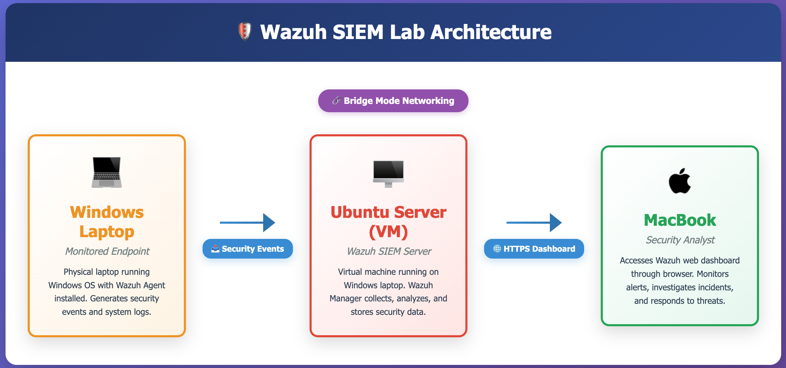

#  End-to-End SOC Lab: Wazuh SIEM & Threat Detection

  

## Project Overview

This project simulates a real-world Security Operations Center (SOC) environment using **Wazuh SIEM**, covering architectural mistakes, networking challenges, and the process of achieving a fully functional SIEM with real endpoints.
I acted as both the **Red Team** (executing Brute Force and Malware attacks) and the **Blue Team** (investigating alerts) to verify end-to-end detection capabilities.

## Network Architecture

* SIEM Server: Ubuntu Server (virtualized on Windows Laptop A) running Wazuh Manager, Indexer, and Dashboard.
* Endpoint: Windows 11 Laptop B with Wazuh Agent installed.
* Analyst Station: macOS system accessing the Wazuh Dashboard via web interface.

---

##  Core Objectives
* Design a realistic SOC architecture with a centralized SIEM (Wazuh) and distributed Windows endpoints.
* SIEM deployment and configuration
* Validate identity security detections by simulating and detecting brute-force authentication attacks.
* Validate endpoint security detections by triggering and analyzing malware/antivirus-related events.dfd
---

## Pipeline Engineering (The "Hidden" Logs)
Standard Wazuh agents do not ingest Antivirus logs out of the box. I had to manually edit the agent's XML configuration to target the specific operational channel used by Windows Defender.
**Code Snippet (ossec.conf):**
```xml
<localfile>
  <location>Microsoft-Windows-Windows Defender/Operational</location>
  <log_format>eventchannel</log_format>
</localfile>
```
---

# Attack Simulation & Detection Results
1. Identity Attack (Brute Force)
Technique: T1110 (Brute Force).
Simulation: Generated continuous authentication failures on the victim machine.
Detection: Wazuh correlated the events and fired Rule 60204 (Multiple Logon Failures).


2. Malware Payload Delivery
Technique: User Execution (Malicious File).
Simulation: Dropped the EICAR Standard Anti-Virus Test File onto the endpoint.
Detection: Windows Defender quarantined the file, and the custom log pipeline successfully forwarded the event to Wazuh, triggering Rule 62123.
------------

##  Challenges & Troubleshooting 

**1. Architecture Incompatibility (ARM64 vs x86_64)**
* **Problem:** I initially attempted to host the Wazuh SIEM on an Ubuntu VM running on Apple Silicon (ARM64). The installation failed—specifically during the **Indexer** service initialization—because Wazuh's core dependencies require x86_64 architecture.
* **Solution:** Instead of relying on unstable x86 emulation, I migrated the backend infrastructure completely. I provisioned the Ubuntu Server VM on a **Windows laptop (native x86_64)**, ensuring full hardware compatibility and stability for the Indexer.
  

**2. "Active" Agent but No Alerts for failed login attempts**
* **Problem:** Wazuh Agent showed as 'Active' but wasn't generating alerts for failed login attempts.
* **Root Cause:** The Windows endpoint was not generating Event ID 4625 because the default Audit Policy suppresses failure logs to save space.
* **Solution:** I used the `auditpol` CLI tool to manually enable failure logging (`auditpol /set /category:"Logon/Logoff" /failure:enable`), immediately restoring visibility.

**3. Missing Antivirus Logs**
* **Problem:** Standard Wazuh rules failed to detect the EICAR test file because Windows Defender writes to a non-standard "Operational" event channel rather than the "System" log.
* **Solution:** I engineered a custom log collection pipeline by editing the `ossec.conf` file to specifically target the `Microsoft-Windows-Windows Defender/Operational` channel.

**4. Dynamic IP Disconnects**
* **Problem:** The Ubuntu server's IP address changed after a reboot, causing the Windows Agent to lose connectivity.
* **Solution:** I troubleshot the connectivity issue using `netstat` and reconfigured the agent to point to the new IP. (Future improvement: Implement Static IP assignment).
----

##  Skills Demonstrated

###  Security Operations 
* **SIEM Operations:** Agent deployment, log aggregation, and alert triage using **Wazuh**.
* **Threat Detection:** Correlating security events to identify patterns (e.g., distinguishing user error from Brute Force).
* **Incident Response:** Validating alerts vs. false positives in a lab environment.

###  Endpoint Security
* **Telemetry Engineering:** Configuring **Windows Advanced Audit Policies** to expose hidden security logs.
* **Log Analysis:** Deep dive into specific Windows Event IDs:
    * `4625` (Failed Logon - Brute Force Indicator)
    * `1116` (Defender Malware Detection)
    * `1001` (Windows Error Reporting)

###  Systems Engineering
* **Pipeline Configuration:** Modifying Wazuh Agent configuration files (`ossec.conf`) to ingest non-standard log channels.
* **Linux Administration:** Managing Ubuntu Server via CLI (Service management, Networking, Permissions).
* **Virtual Networking:** Implementing **Bridged Adapters** to enable communication between isolated VM subnets and physical hosts.


##  Project Roadmap / Future Scope

### Phase 2: Advanced Threat Emulation (Red Teaming)
* **Kali Linux Integration:** Deploy a Kali Linux VM to act as an external adversary.
* **Network Attack Simulation:** Use **Hydra** (SSH/RDP Brute Force) and **Nmap** (Port Scanning) to test network-layer detection rules.
* **Web Attacks:** Simulate SQL Injection (SQLi) and XSS against a vulnerable web server to test Wazuh's web log analysis capabilities.

### Phase 3: Active Response (SOAR)
* **Automated Blocking:** Configure **Wazuh Active Response** to automatically firewall IP addresses after 5 failed login attempts.
* **Process Termination:** Create scripts to instantly kill malicious processes (like the EICAR test) upon detection.

### Phase 4: Enterprise Expansion
* **File Integrity Monitoring (FIM):** Configure policies to track unauthorized changes to critical system files (`/etc/passwd` or `System32`), detecting persistence mechanisms.
* **MITRE ATT&CK Mapping:** Fine-tune existing rules to map alerts directly to specific TTPs (Tactics, Techniques, and Procedures) for better reporting.

